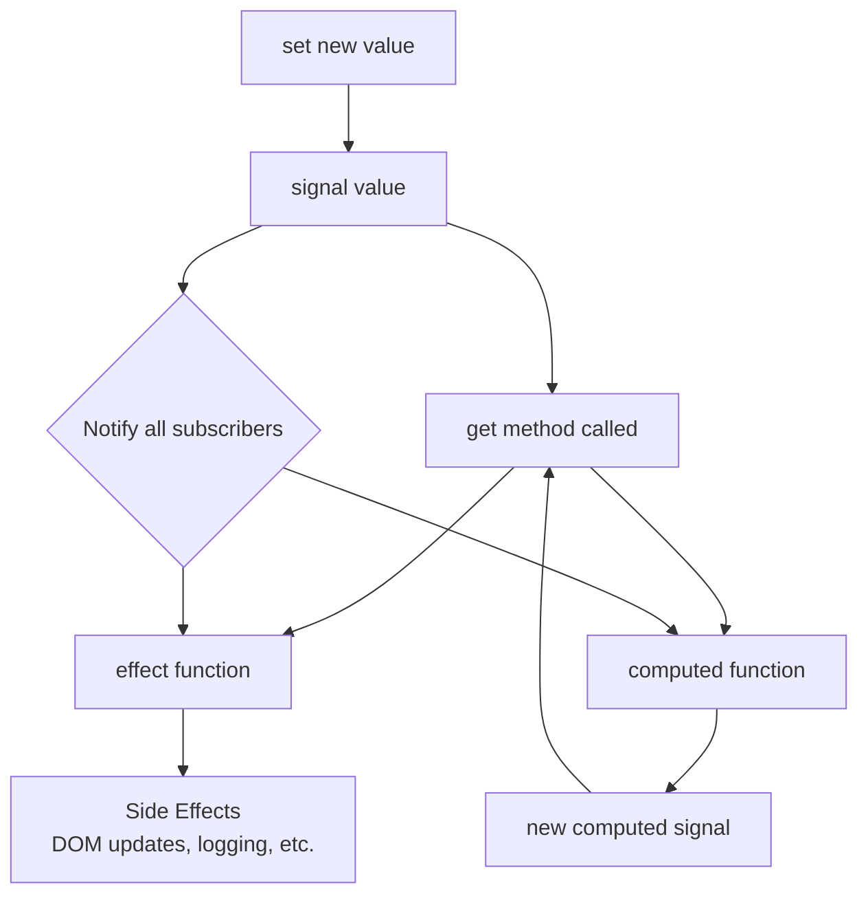

# Signal Demonstration

This repository contains a simple, vanilla JavaScript implementation of a reactive programming pattern, often referred to as "signals." This pattern allows you to create reactive values and automatically re-run code that depends on those values when they change.

## What is Reactive Programming? (For Beginners)

Imagine you have a spreadsheet where cell C1 contains the formula `=A1 + B1`. When you change the value in A1 or B1, cell C1 automatically updates to show the new result. You don't have to manually recalculate C1 - the spreadsheet does it for you!

Reactive programming works similarly in code. Instead of manually updating everything when data changes, the system automatically keeps everything in sync. This is what "signals" help us achieve in JavaScript.

## How it Works

The core idea revolves around three main functions: `signal`, `effect`, and `computed`. Think of them as building blocks for creating reactive applications.

### `signal(initialValue)` - The Data Container

A `signal` is like a smart box that holds a value. What makes it "smart" is that it can remember who is interested in its value and notify them when the value changes.

**Real-world analogy**: Think of a signal like a news channel. The news channel (signal) broadcasts information (the value), and viewers (effects and computed values) automatically get updates when there's breaking news (value changes).

- **`get()`**: This is how you "read" or "subscribe to" the signal's current value. When an `effect` or `computed` function calls `get()` on a signal, it's like saying "Hey, I want to know whenever this value changes!"
- **`set(newValue)`**: This is how you update the signal's value. When you call `set()`, the signal automatically notifies everyone who called `get()` before, telling them "The value changed, you should update yourself!"

### `effect(fn)` - The Side Effect Handler

An `effect` is a function that runs automatically whenever the signals it depends on change. It's perfect for doing things like updating the user interface, sending network requests, or logging information.

**Real-world analogy**: Think of an effect like a security guard who monitors multiple alarm systems (signals). Whenever any alarm goes off (signal value changes), the security guard automatically responds (the effect function runs).

**Example use cases**:
- Updating a text element in HTML when a username changes
- Sending an API request when a search query changes
- Logging debug information when any value changes

### `computed(fn)` - The Derived Value

A `computed` value is like having a formula in a spreadsheet. It automatically calculates a new value based on other signals, and when those signals change, the computed value recalculates itself.

**Real-world analogy**: Think of a computed value like a calculator that's connected to multiple input devices. When any input changes, the calculator automatically shows the new result.

**Example use cases**:
- Calculating the total price (including tax) when the base price or tax rate changes
- Creating a full name from first name and last name signals
- Computing whether a form is valid based on multiple input fields

## How Signals Work Together (Visual Guide)



## Step-by-Step Explanation (Beginner-Friendly)

Let's walk through what happens in the diagram above:

### Step 1: Creating and Reading Signals
1. **`signal(value)`** - You create a signal with an initial value (like a variable, but smarter)
2. **`get()`** - When your code reads the signal's value, the signal remembers "who asked"

### Step 2: Setting Up Automatic Reactions
3. **`effect(fn)`** - You create a function that should run whenever certain signals change
4. **`computed(fn)`** - You create a derived value that depends on other signals

### Step 3: The Magic Happens
5. **`set(newValue)`** - When you change a signal's value...
6. **Notify Subscribers** - The signal automatically tells everyone who was listening
7. **Auto-Update** - All effects and computed values automatically re-run with the new data

### A Simple Example to Understand

Imagine you're building a shopping cart:

```javascript
// Step 1: Create signals for your data
const price = signal(10);        // Item costs $10
const quantity = signal(2);      // User wants 2 items
const taxRate = signal(0.08);    // 8% tax

// Step 2: Create computed values that depend on the signals
const subtotal = computed(() => price.get() * quantity.get());
const tax = computed(() => subtotal.get() * taxRate.get());
const total = computed(() => subtotal.get() + tax.get());

// Step 3: Create effects that update the user interface
effect(() => {
    document.getElementById('total').textContent = `$${total.get().toFixed(2)}`;
});

// Step 4: When data changes, everything updates automatically!
quantity.set(3); // User changes quantity to 3
// The total on the page automatically updates to $32.40!
```

**What makes this powerful**:
- You only change `quantity.set(3)` in one place
- The `subtotal` automatically recalculates: 10 × 3 = 30
- The `tax` automatically recalculates: 30 × 0.08 = 2.40
- The `total` automatically recalculates: 30 + 2.40 = 32.40
- The webpage automatically updates to show $32.40

You don't have to manually update each calculation or remember to update the display - it all happens automatically!

## Key Concepts for Computer Science Students

**Dependency Tracking**: The system automatically figures out what depends on what. When `quantity` changes, it knows to update `subtotal`, which triggers updates to `tax` and `total`.

**Observer Pattern**: This is a classic design pattern where objects (signals) maintain a list of dependents (effects/computed) and notify them of state changes.

**Declarative Programming**: Instead of writing step-by-step instructions (imperative), you declare relationships between data (declarative). The system figures out the execution order.

**Reactive Programming**: This is a programming paradigm oriented around data flows and the propagation of change - perfect for user interfaces and real-time applications.
